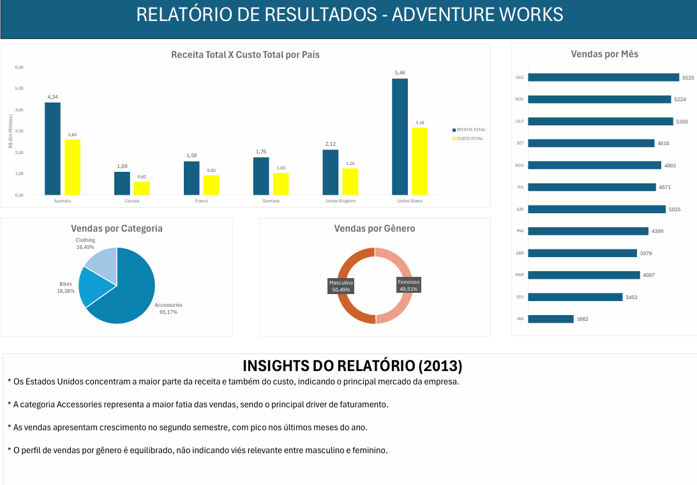

# Adventure Works Internet Sales BI

## 🖼️ Visão Geral do Relatório

## 📊 Contexto do Projeto
Projeto de Business Intelligence com foco na integração entre **SQL Server** e **Excel** para análise de vendas de internet da base **Adventure Works 2014**.

O objetivo foi centralizar os dados em uma única *view* no SQL Server, facilitando o consumo no Excel e a geração de indicadores de negócio.

---

## 🎯 Objetivo
- Consolidar dados de vendas em uma view única no SQL Server  
- Facilitar a análise de desempenho por diferentes dimensões de negócio  
- Gerar insights a partir de indicadores claros e objetivos  

---

## 🛠️ Tecnologias Utilizadas
- SQL Server  
- Excel  
- Base de dados Adventure Works 2014  

---

## 🗂️ Modelagem dos Dados
A solução foi construída a partir da tabela fato **FactInternetSales**, com relacionamento em cadeia até **DimProductCategory**, além das dimensões:

- DimCustomer  
- DimSalesTerritory  

Essa abordagem permite análises por categoria de produto, perfil do cliente e localização geográfica.

---

## 📈 Indicadores Analisados
- Receita e custo total de vendas por país  
- Total de vendas por mês  
- Total de vendas por categoria de produto  
- Total de vendas por gênero do cliente  

---

## 🔎 Principais Insights
- Os Estados Unidos concentram a maior parte da receita e do custo, sendo o principal mercado da empresa  
- A categoria *Accessories* representa a maior fatia das vendas totais  
- As vendas apresentam crescimento no segundo semestre, com pico nos últimos meses do ano  
- O volume de vendas por gênero é equilibrado, sem viés significativo  

---

## 📌 Escopo da Análise
- Ano analisado: **2013**
- Apenas vendas realizadas via internet  

---

## 📁 Arquivos do Projeto
- `query_view_vendas_internet.sql` → Criação da view no SQL Server  
- `relatorio_adventure_works.xlsx` / `relatorio_adventure_works.pdf` → Relatório com gráficos e insights  

---

## ✅ Conclusão
O projeto demonstra a aplicação prática de SQL Server para modelagem de dados e o uso do Excel como ferramenta de visualização, seguindo um fluxo comum em ambientes de Business Intelligence.
